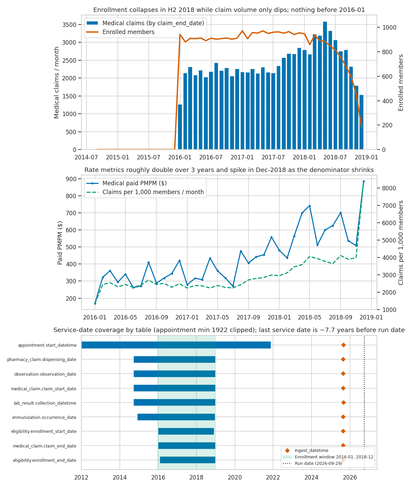

# Input layer freshness and the synthetic data's date distribution

This page covers two things:

1. The elapsed-time / freshness check added under `models/data_quality` and `tests/data_quality`.
2. What the date distribution of the synthetic input layer (Tuva synthetic data 0.15.0 / 0.16.0, loaded by the seed post-hooks in `dbt_project.yml`) implies for any trend analysis built on this demo.

Numbers below come from a local DuckDB build on 2026-09-29. Reproduce them with
`dbt build --select data_quality__input_layer_date_freshness+` and the analysis
`analyses/input_layer_monthly_trend_profile.sql`.



## 1. The freshness check

### `data_quality__input_layer_date_freshness` (schema `data_quality`)

One row per (input layer table, date column), covering 21 date/datetime columns across
`medical_claim`, `pharmacy_claim`, `eligibility`, `lab_result`, `observation`, `immunization`
and `appointment`. Each column is tagged with a `date_role`:

| date_role | meaning | columns |
|---|---|---|
| `service` | when care happened / coverage was active | claim start/end, dispensing, enrollment start/end, collection, observation, occurrence, appointment start |
| `adjudication` | when the claim was paid | `paid_date` |
| `file` | source feed period | `file_date` |
| `ingest` | warehouse load time | `ingest_datetime` |

For each column the model records row/non-null counts, `min_date`, `max_date`, and elapsed days against three anchors:

| column | anchor | question it answers |
|---|---|---|
| `days_since_max_date` | `as_of_date` (run date, or var `data_freshness_as_of_date`) | How old is the newest data? |
| `days_max_date_before_period_end` | `analysis_period_end` (var `data_freshness_period_end`, defaults to `quality_measures_period_end`) | Does the data reach the period the marts are configured for? |
| `days_max_date_to_ingest` | the table's latest `ingest_datetime` | Load latency: how long after the last service date was the data loaded? |
| `days_min_date_before_enrollment_window` / `days_max_date_after_enrollment_window` | min/max eligibility enrollment dates | Is there activity that can't be tied to member months? |

It also derives `wall_clock_status` (`fresh` / `stale` / `missing`, threshold `data_freshness_stale_after_days`, default 90) and
`period_coverage_status` (`covers_period_end` / `short_of_period_end` / `extends_past_period_end` / `missing`, threshold `data_freshness_max_days_short_of_period_end`, default 31).

All SQL uses `dbt.datediff`, `dbt.current_timestamp` and `cast(... as date)`, so it runs on every adapter the project supports (only DuckDB was actually run).

### Tests

| test | severity | fails / warns when | result on the demo data |
|---|---|---|---|
| `assert_input_layer_service_dates_reach_period_end` | error | a service-date column is empty, or its max is more than 31 days before the analysis period end | pass (all service dates reach 2018-12-29..2018-12-31). Fails (8 rows) with `--vars '{data_freshness_period_end: "2019-12-31"}'`, which is what happens if the period vars and the seeds get out of sync |
| `assert_input_layer_service_dates_within_enrollment_window` | warn | non-eligibility service dates fall before or after the enrollment window | warns: 6 columns (clinical, pharmacy and claim_start data from 2014-09, appointments up to 2021-11) |
| `assert_input_layer_wall_clock_freshness` | warn | service or ingest dates are more than 90 days older than the run date | warns: all 16 service/ingest columns. This is expected for a static demo dataset and is meant to become an error once a live feed replaces the seeds |

Plus schema tests on the model: `not_null`, `accepted_values` on `date_role`, and uniqueness of (`source_table`, `date_column`).

To simulate a point-in-time run (for example "as if we ran this in the first quarter of 2019"):

```bash
dbt build --select data_quality__input_layer_date_freshness+ --vars '{data_freshness_as_of_date: "2019-02-15"}'
```

## 2. What the date distribution means for trend analysis

### Snapshot of the date coverage

| table | service date range | latest ingest | elapsed to 2026-09-29 |
|---|---|---|---|
| eligibility (enrollment) | 2016-01-01 .. 2018-12-31 | 2025-08-26 | 2,829 days since the last covered day |
| medical_claim (`claim_end_date`) | 2016-01-01 .. 2018-12-29 | 2025-08-26 | 2,831 days |
| medical_claim (`claim_start_date`) | 2014-09-16 .. 2018-12-29 | 2025-08-26 | 2,831 days |
| pharmacy_claim (`dispensing_date`) | 2014-09-16 .. 2018-12-29 | 2025-08-26 | 2,831 days |
| lab_result / observation | 2014-09-16 .. 2018-12-29 | 2025-08-26 / 2025-09-04 | 2,831 days |
| immunization | 2014-11-29 .. 2018-12-23 | 2025-08-26 | 2,837 days |
| appointment (`start_datetime`) | 1922-03-19 .. 2021-11-18 | 2025-09-04 | 1,776 days |
| provider_attribution_source (`year_month`) | 201605 .. 201806 (85 of 100 rows are 201605) | n/a | n/a |

Population: 1,000 people, all Medicare (`payer = plan = payer_type = medicare`), 2,309 enrollment spans, age at 2018-12-31 ranges 28..100 (median around 72).

### Implications

1. **The data is roughly 7.7 years stale and does not move.** Service dates stop at 2018-12-29/31 while the run date is 2026. `ingest_datetime` is a single constant per table (2025-08-26 or 2025-09-04), i.e. when the synthetic files were packaged, not when claims arrived. Any "last N months", "YTD" or "rolling 12" logic anchored on `current_date` returns nothing. Trend windows must be anchored to the data (max service date or `quality_measures_period_end` / `cms_hcc_payment_year`), which is why the demo pins these to 2018.

2. **Only 2016-01..2018-12 (36 months) can support rate-based trends.** Enrollment, and therefore member months, exists only in that window. Pharmacy, labs, observations, immunizations and claim start dates go back to 2014-09 (for example 1,609 pharmacy claims and about 25k labs before 2016), and appointments run from 1922 to 2021-11 (2,232 appointments after 2018 for 681 people). Activity outside the window has no denominator: it either drops out of PMPM/per-1,000 metrics or inflates raw-count trends. Three calendar years is the most you can compare year over year, and only 2017 and 2018 have a full prior year to compare against.

3. **Enrollment is a closed, left-censored cohort that runs off in 2018.** 942 of the 1,000 members start on 2016-01-01 (left-censored, so their real start date is unknown) and only 58 join later. Monthly enrolled members hold around 900-970 through early 2018, then fall to 451 in Nov-2018 and 183 in Dec-2018. Only 39 deaths are recorded, so the run-off is enrollment ending, not mortality. So:
   - Raw volume trends in H2-2018 fall because the denominator is shrinking, not because utilization drops.
   - Rate trends spike at the tail. Dec-2018 comes out at 8,388 claims per 1,000 members and \$885 PMPM, against about 4,000 and \$500-700 in the prior months. Partly that's because 572 of the 1,535 Dec-2018 claims (37%) belong to members with no active enrollment that month.
   - A closed cohort ages about 3 years over the window. Age-driven cost growth is baked in, and there's no new-entrant mix to offset it.

4. **The utilization/cost trend is steep and probably a synthetic-generator artifact.** For claims tied to active enrollment, annualized claims per 1,000 member-years go 26.8k (2016) → 28.5k (2017) → 39.8k (2018), and paid PMPM goes \$303 → \$368 → \$524 (+73% in two years). Inpatient admissions go 112 → 159 → 182 while member months fall 19%. Real Medicare trend is in the single digits per year, so don't present this as a benchmarkable "medical trend". It's fine for demonstrating how the marts work, not for drawing conclusions about the trend itself.

5. **No claims lag, so completion factors and IBNR can't be demonstrated.** `file_date` always equals the first day of the service month, for 100% of medical and pharmacy rows. Medical `paid_date` is 100% null, and pharmacy `paid_date` always equals `dispensing_date`. Every month is 100% complete as soon as it happens. The dataset can't show a lag triangle, run-out, or the usual under-reported most recent months. Any trend built on real data will need completion adjustments this demo never exercises.

6. **Edges and calendar effects.**
   - Jan-2016 has about half the claims of later months (1,267 compared with around 2,100-2,300), because claims are bucketed by `claim_end_date` and the window starts on 2016-01-01. Treat the first month as partial, or exclude it.
   - Claim end dates are spread evenly across the days of the week (about 12.2k-12.7k claims each, weekends included). Real professional claims cluster heavily on weekdays, so day-of-week or working-day analysis means nothing here.
   - Seasonality is weak and mostly an upward drift: the Jan-2016 edge dip plus rising volumes. There's no real flu-season signal to model.

7. **Point-in-time attribution is thin.** Provider attribution has 4 `year_month` values, and 85% of rows are 201605. Monthly attribution trends are effectively one snapshot.

### Recommendations for trend work on this dataset

- Anchor every time window to the data (`max(claim_end_date)` or the pinned period vars), never to `current_date`. Or set `data_freshness_as_of_date` to make runs deterministic.
- Restrict rate trends to 2016-02..2018-10. That drops the partial first month and the run-off tail. Always report rates next to member months.
- Only count utilization that falls inside an active enrollment span when computing PMPM or per-1,000 rates.
- Present the 2016-2018 trend as illustrative synthetic behavior, not as a benchmark. Label charts accordingly.
- Before pointing this project at real data, make `assert_input_layer_wall_clock_freshness` an error and set `data_freshness_stale_after_days` to the feed's SLA.

## Assumptions

- "Freshness" is evaluated on the seeded input layer tables, not on Tuva's downstream marts, and datetimes are truncated to dates.
- The analysis period end defaults to `quality_measures_period_end` (2018-12-31), because that's the period the demo's marts are configured for.
- 90 days for wall-clock staleness and 31 days of allowed shortfall at the period end roughly match a monthly claims feed with a quarter of run-out. Both are vars and can be tuned.
- The two checks that always fire on static demo data are warnings, so `dbt build` keeps passing in CI. Only the period-coverage check is an error.
- `provider_attribution_source.year_month` is a `YYYYMM` string and is left out of the date profile.
