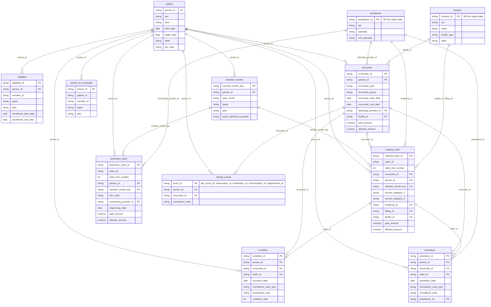

# Warehouse ERD (star schema)

How the analyst-facing tables join. Column-level detail for every table is in
the [data dictionary](data_dictionary/README.md).

The warehouse is built by the [Tuva Project](https://github.com/tuva-health/tuva)
dbt package in three layers:

1. **Input layer** (`models/*.sql` in this repo) maps the synthetic seeds into
   Tuva's input contract. Analysts should not query it.
2. **Core** (`core` schema) is the conformed star schema below. Every mart is
   built from it.
3. **Marts** (one schema per mart) are subject-area outputs that join back to
   Core on a small set of conformed keys (second diagram).

## Conformed keys

| Key | Defined in | Meaning | Used by |
|---|---|---|---|
| `person_id` | `core.patient` | One person across all sources (claims `member_id`s and clinical `patient_id`s are mapped to it via `core.person_id_crosswalk`). | Every fact and every member-level mart |
| `member_month_key` | `core.member_months` | Surrogate for `person_id` + `year_month` + `payer` + `plan` + `data_source`. | `core.medical_claim`, `core.pharmacy_claim` |
| `year_month`, `payer`, `plan` | `core.member_months` | Enrollment month (`YYYYMM`) and coverage. Denominator for PMPM and rates. | `financial_pmpm`, `hcc_recapture`, `ed_classification` |
| `encounter_id` | `core.encounter` | One visit / stay, grouped from claim lines or taken from the EHR. | Claims, clinical events, `ccsr`, `readmissions`, `ed_classification`, `ahrq_measures` |
| `claim_id` | `core.medical_claim` / `core.pharmacy_claim` | Claim header; claim lines are `claim_id` + `claim_line_number`. | `condition`, `procedure`, `ccsr`, `chronic_conditions`, `pharmacy` |
| `practitioner_id` | `core.practitioner` | Individual provider; for claims data this is the NPI. | `rendering_id`, `prescribing_provider_id`, `attending_provider_id`, `provider_id` in `provider_attribution` |
| `location_id` | `core.location` | Facility / organization; for claims data this is the NPI. | `facility_id`, `billing_id` on claims and encounters |
| `data_source` | every table | Source system name. Include it in joins when more than one source is loaded. | All tables |

## Core star schema

Facts are claim lines, encounters, and clinical events. `patient`,
`member_months`, `practitioner`, and `location` are the dimensions;
`encounter` is both a fact (visits) and a dimension for claim lines and
clinical events.

`clinical_events` is a stand-in for the five clinical-only event tables
(`lab_result`, `observation`, `medication`, `immunization`, `appointment`),
which all share the `person_id` / `encounter_id` pattern. They are empty unless
clinical (EHR) data is loaded.

## Marts: how they conform to Core

Each mart table joins back to Core on the keys shown. Tables sharing a key
can be joined to each other on that key (e.g. `cms_hcc.patient_risk_scores`
to `chronic_conditions.tuva_chronic_conditions_wide` on `person_id`).

```mermaid
erDiagram
    patient ||--o{ financial_pmpm__pmpm_prep : "person_id"
    member_months ||--|| financial_pmpm__pmpm_prep : "person_id + year_month + payer + plan"
    member_months }o--|| financial_pmpm__pmpm_payer_plan : "year_month + payer + plan"
    member_months }o--|| financial_pmpm__pmpm_payer : "year_month + payer"

    patient ||--o{ cms_hcc__patient_risk_scores : "person_id"
    patient ||--o{ cms_hcc__patient_risk_factors : "person_id"
    patient ||--o{ hcc_suspecting__list : "person_id"
    patient ||--o{ hcc_recapture__hcc_status : "person_id"
    patient ||--o| chronic_conditions__tuva_chronic_conditions_wide : "person_id"
    patient ||--o{ chronic_conditions__tuva_chronic_conditions_long : "person_id"
    patient ||--o{ quality_measures__summary_long : "person_id"
    patient ||--o| quality_measures__summary_wide : "person_id"
    patient ||--o{ tuva_provider_attribution__assigned_beneficiaries_yearly : "person_id"
    practitioner ||--o{ tuva_provider_attribution__assigned_beneficiaries_yearly : "provider_id"

    encounter ||--o| readmissions__encounter_augmented : "encounter_id"
    encounter ||--o| readmissions__readmission_summary : "encounter_id"
    encounter ||--o| ed_classification__summary : "encounter_id"
    encounter ||--o{ ahrq_measures__pqi_num_long : "encounter_id"
    encounter ||--o{ ccsr__long_condition_category : "encounter_id"
    medical_claim ||--o{ ccsr__long_condition_category : "claim_id"
    medical_claim ||--o{ ccsr__long_procedure_category : "claim_id"
    pharmacy_claim ||--|| pharmacy__pharmacy_claim_expanded : "claim_id + claim_line_number"
    pharmacy_claim ||--o{ pharmacy__brand_generic_opportunity : "claim_id + claim_line_number"
```

Mart tables not drawn above are roll-ups of the ones that are (e.g.
`cms_hcc.patient_risk_scores_monthly`, `hcc_recapture.recapture_rates`,
`ahrq_measures.pqi_rate`, `quality_measures.summary_counts`); their grain is
listed in the data dictionary.

## Common joins

- **Spend per member per month:** `financial_pmpm.pmpm_prep` already has one
  row per `person_id` + `year_month` + `payer` + `plan`; sum and divide by the
  row count. Joining raw `core.medical_claim` to `core.member_months` should
  use `member_month_key`.
- **Claims for an encounter:** `core.medical_claim.encounter_id = core.encounter.encounter_id`
  (many claim lines per encounter; `encounter.paid_amount` is already the sum).
- **Risk score with demographics:** `cms_hcc.patient_risk_scores` to
  `core.patient` on `person_id`.
- **Readmissions by facility:** `readmissions.readmission_summary.facility_id`
  to `core.location.location_id`.

## Not shown

- **Semantic layer** (`semantic_layer` schema, `dim_*` / `fact_*` tables) is a
  Tuva mart that repackages Core as a BI-oriented star. It is off by default
  (`semantic_layer_enabled: false`) and not enabled in this project.
- **Terminology / reference data** (`terminology`, `reference_data`, value set
  schemas) are lookup tables loaded from Tuva seeds.
- **Intermediate models** (`*__int_*`, `*__stg_*`) and supporting marts such as
  `claims_preprocessing`, `service_category`, and `data_quality`.
